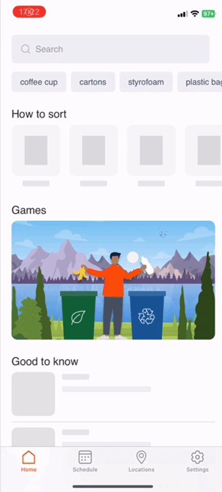

# SwiftUI-ShimmeringView

[](https://swift.org)
[](https://developer.apple.com)

Nice and simple replacement of a boring spinner loader. Do not block your users while the data is on the way!

<p>
  
</p>

## Usage

1. Import the package
```swift
import ShimmeringView
```
2. Add the function to your view as per example
```swift
  HStack {
      Image("ic_def_avatar")
        .padding() 
      Text("Hello")
        .padding()
  }
  .shimmering()
```


## Requirements

- Swift 5.5+
- iOS 14.0+, macOS 11.0+

## Installation
### Swift Package Manager
`SwiftUI-ShimmeringView` is available through [Swift Package Manager](https://swift.org/package-manager/). 

To add package go to `File -> Swift Packages -> Add Package Dependancy `

```ruby
name: "SwiftUI-ShimmeringView"
url: https://github.com/Ninise/swiftui-shimmeringview.git
version: 1.0.0
```
